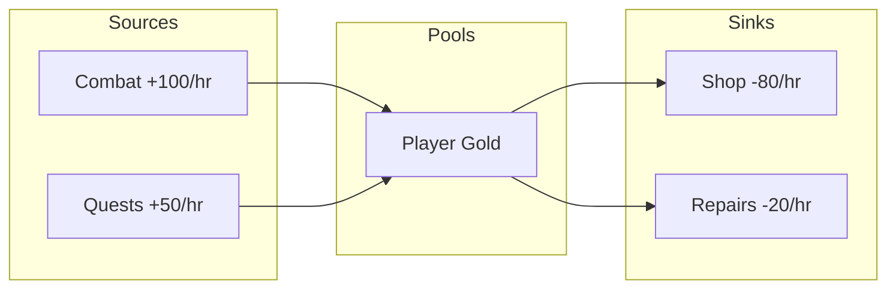

# Economy Balancer

Model game economies using Daniel Cook's faucet-drain (value chain) framework. Define resource sources, transforms, and sinks to calculate steady states, identify bottlenecks, and balance resource flows.

## When to Use This Skill

Use this skill when asked to:
- Design a new game economy from scratch
- Balance an existing economy that feels off
- Identify resource bottlenecks or inflation problems
- Model crafting, progression, or currency systems
- Analyze why players feel starved or flooded with resources

---

## The Faucet-Drain Model

All game economies can be modeled as flows from sources to sinks:

```
┌─────────────────────────────────────────────────────────────────┐
│                     FAUCET-DRAIN ECONOMY                        │
├─────────────────────────────────────────────────────────────────┤
│                                                                 │
│  ┌──────────┐                                                   │
│  │  SOURCE  │  Creates resources from nothing                   │
│  │ (Faucet) │  Examples: enemy drops, daily rewards, mining     │
│  └────┬─────┘                                                   │
│       │                                                         │
│       ▼                                                         │
│  ┌──────────┐                                                   │
│  │   POOL   │  Accumulates and stores resources                 │
│  │          │  Examples: inventory, bank, stockpile             │
│  └────┬─────┘                                                   │
│       │                                                         │
│       ▼                                                         │
│  ┌───────────┐                                                  │
│  │ TRANSFORM │  Converts resources (A + B → C)                  │
│  │           │  Examples: crafting, upgrading, combining        │
│  └────┬──────┘                                                  │
│       │                                                         │
│       ▼                                                         │
│  ┌──────────┐                                                   │
│  │   GATE   │  Controls flow conditionally                      │
│  │          │  Examples: level requirements, unlock conditions  │
│  └────┬─────┘                                                   │
│       │                                                         │
│       ▼                                                         │
│  ┌──────────┐                                                   │
│  │   SINK   │  Destroys resources permanently                   │
│  │ (Drain)  │  Examples: consumables, repair costs, upgrades    │
│  └──────────┘                                                   │
│                                                                 │
└─────────────────────────────────────────────────────────────────┘
```

### Key Principle

**Sources must equal sinks at steady state.** If sources > sinks, you get inflation. If sinks > sources, you get starvation.

---

## Analysis Process

### Step 1: Inventory Resources

List all resources in the economy:

```
RESOURCE INVENTORY
==================

Resource: [Name]
  Type: [Currency / Material / Consumable / Equipment / Token]
  Stackable: [Yes / No]
  Cap: [None / Number]
  Tradeable: [Yes / No]
  Description: [What it represents]
```

### Step 2: Map Sources (Faucets)

For each source of resources:

```
SOURCE: [Name]
==============
ID: SRC-[number]
Output: [resource] x [amount]
Rate: [per action / per time unit]
Trigger: [what causes generation]
Limits: [caps, cooldowns, requirements]

Calculation:
  Base output: [amount]
  Frequency: [times per hour/day for active player]
  Expected hourly output: [amount/hour]
```

### Step 3: Map Sinks (Drains)

For each way resources leave the economy:

```
SINK: [Name]
============
ID: SNK-[number]
Input: [resource] x [amount]
Trigger: [what causes consumption]
Output: [what player receives, if anything]
Desirability: [Low / Medium / High / Essential]

Calculation:
  Cost per use: [amount]
  Expected uses per hour: [frequency]
  Expected hourly drain: [amount/hour]
```

### Step 4: Map Transforms

For each conversion between resources:

```
TRANSFORM: [Name]
=================
ID: TRN-[number]
Inputs: [resource A] x [amount], [resource B] x [amount]
Output: [resource C] x [amount]
Conversion ratio: [e.g., 3:1, 10:2:1]
Reversible: [Yes / No]
```

### Step 5: Map Gates

For each conditional flow control:

```
GATE: [Name]
============
ID: GAT-[number]
Condition: [what must be true to pass]
Blocks: [what resource flow is gated]
One-time: [Yes / No]
```

### Step 6: Calculate Flow Balance

```
FLOW BALANCE: [Resource Name]
=============================

SOURCES (Inflow)
----------------
SRC-1: [name]         +[amount]/hour
SRC-2: [name]         +[amount]/hour
                      ─────────────────
Total Inflow:         +[total]/hour

SINKS (Outflow)
---------------
SNK-1: [name]         -[amount]/hour
SNK-2: [name]         -[amount]/hour
                      ─────────────────
Total Outflow:        -[total]/hour

NET FLOW:             [+/-][amount]/hour

VERDICT:
[ ] BALANCED (net flow ≈ 0)
[ ] INFLATIONARY (net flow > 0, resources accumulate)
[ ] DEFLATIONARY (net flow < 0, resources deplete)
```

---

## Balance Techniques

### Balancing Inflation (Too Much Resource)

| Technique | Description |
|-----------|-------------|
| Add sinks | Create desirable ways to spend resources |
| Reduce source rate | Lower drop rates, extend cooldowns |
| Add soft caps | Diminishing returns at high quantities |
| Create aspirational goals | Expensive items players save for |
| Introduce upkeep | Ongoing costs to maintain items/status |

### Balancing Scarcity (Too Little Resource)

| Technique | Description |
|-----------|-------------|
| Add sources | New ways to earn resources |
| Increase source rate | Higher drop rates, shorter cooldowns |
| Reduce sink costs | Lower prices, reduce consumption |
| Add catch-up mechanics | Bonus gains for resource-poor players |
| Create alternatives | Different resources for same goals |

### Healthy Economy Indicators

- [ ] Players always have meaningful choices to make
- [ ] No resource becomes worthless (infinite accumulation)
- [ ] No resource becomes unobtainable (permanent scarcity)
- [ ] Multiple viable strategies (not one optimal path)
- [ ] Progress feels achievable but not trivial
- [ ] Sinks feel desirable, not punishing

---

## Output Format

When analyzing an economy, provide:

### 1. Resource Inventory Table

| Resource | Type | Sources | Sinks | Net Flow | Status |
|----------|------|---------|-------|----------|--------|
| Gold | Currency | Combat, Quests | Shop, Repairs | +50/hr | Inflationary |
| Wood | Material | Gathering | Crafting | -10/hr | Deflationary |

### 2. Flow Diagram



### 3. Steady State Analysis

```
STEADY STATE PROJECTION
=======================

At current rates, after 10 hours of play:

Gold:
  Starting: 0
  Earned: 1,500
  Spent: 1,000
  Balance: 500 (accumulating)
  Projection: Will hit soft cap in ~20 hours

Wood:
  Starting: 100
  Gathered: 200
  Used: 300
  Balance: 0 (depleted)
  Projection: Will stall crafting progression
```

### 4. Bottleneck Identification

```
BOTTLENECKS
===========

CRITICAL: Wood shortage
  - Source rate: 20/hour
  - Sink rate: 30/hour
  - Deficit: -10/hour
  - Impact: Crafting halts, progression blocked
  - Fix: Add wood source OR reduce recipe costs

WARNING: Gold inflation
  - Accumulation rate: +50/hour
  - No meaningful sinks after hour 5
  - Impact: Gold becomes worthless
  - Fix: Add aspirational purchases OR upkeep costs
```

### 5. Recommendations

```
ECONOMY BALANCE RECOMMENDATIONS
===============================

1. [CRITICAL] Add wood source
   - Option A: Daily login bonus (+50 wood)
   - Option B: Combat wood drops (10% chance, +5 wood)
   - Option C: Reduce crafting costs by 30%

2. [IMPORTANT] Create gold sinks
   - Option A: Cosmetic shop (100-1000 gold items)
   - Option B: Equipment durability system
   - Option C: Upgrade system with scaling costs

3. [POLISH] Smooth early game curve
   - Starter pack with 1 hour of materials
   - Tutorial quest that teaches gathering
```

---

## Example: Simple Crafting Economy

```
RESOURCES
=========
- Gold (currency)
- Wood (material)
- Stone (material)
- Tools (equipment)

SOURCES
=======
SRC-1: Combat Loot
  Output: Gold x 10
  Rate: Per enemy killed
  Expected: 100 gold/hour (10 kills/hour)

SRC-2: Wood Gathering
  Output: Wood x 5
  Rate: Per tree
  Expected: 50 wood/hour (10 trees/hour)

SRC-3: Stone Mining
  Output: Stone x 3
  Rate: Per rock
  Expected: 30 stone/hour (10 rocks/hour)

TRANSFORMS
==========
TRN-1: Craft Axe
  Input: Wood x 10, Stone x 5
  Output: Tool (Axe) x 1
  Effect: 2x wood gathering speed

TRN-2: Craft Pickaxe
  Input: Wood x 5, Stone x 10
  Output: Tool (Pickaxe) x 1
  Effect: 2x stone mining speed

SINKS
=====
SNK-1: Tool Durability
  Input: Tool uses
  Rate: Tool breaks after 100 uses
  Expected: 1 tool/hour

SNK-2: Shop Purchases
  Input: Gold x varies
  Desirability: Medium (convenience items)
  Expected: 50 gold/hour

FLOW ANALYSIS
=============
Gold: +100/hr (combat) - 50/hr (shop) = +50/hr NET INFLATIONARY
Wood: +50/hr (gathering) - 10/hr (axe) - 5/hr (pick) = +35/hr NET INFLATIONARY
Stone: +30/hr (mining) - 5/hr (axe) - 10/hr (pick) = +15/hr NET INFLATIONARY

VERDICT: Economy is inflationary. All resources accumulate.
Need more sinks or reduced sources.

RECOMMENDATIONS:
1. Add tool repair costs (gold sink)
2. Add building system (wood/stone sink)
3. Reduce drop rates by 30%
```

---

## Advanced: Multi-Resource Transforms

For complex crafting chains:

```
VALUE CHAIN: Iron Sword
=======================

Stage 1: Raw Materials
  Iron Ore (mine) →
  Coal (mine) →

Stage 2: Refined Materials
  Iron Ore + Coal → Iron Ingot (smelting)

Stage 3: Components
  Iron Ingot + Wood → Sword Blade (smithing)
  Leather + Wood → Sword Handle (crafting)

Stage 4: Final Product
  Sword Blade + Sword Handle → Iron Sword (assembly)

TOTAL INPUTS:
  Iron Ore x 2
  Coal x 1
  Wood x 2
  Leather x 1

TIME TO CRAFT: ~15 minutes active play
DURABILITY: 200 uses
REPLACEMENT RATE: Every 2 hours

STEADY STATE REQUIREMENT:
  Iron Ore: 1/hour
  Coal: 0.5/hour
  Wood: 1/hour
  Leather: 0.5/hour
```

---

## Reference

Based on Daniel Cook's frameworks:
- [Value Chains](https://lostgarden.com/2021/12/12/value-chains/)
- [Prosocial Economics for Game Design](https://lostgarden.com/2020/01/11/prosocial-economics-for-game-design/)
