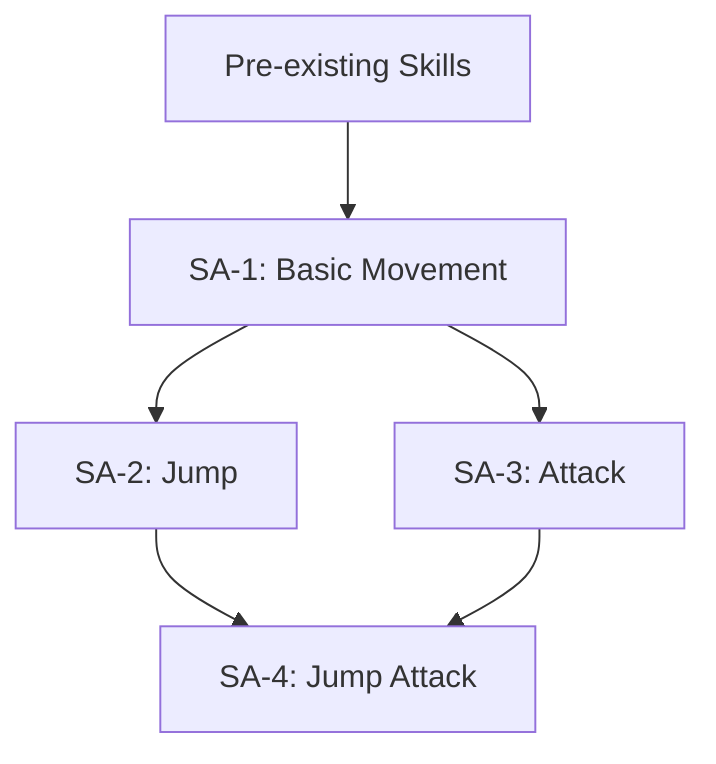
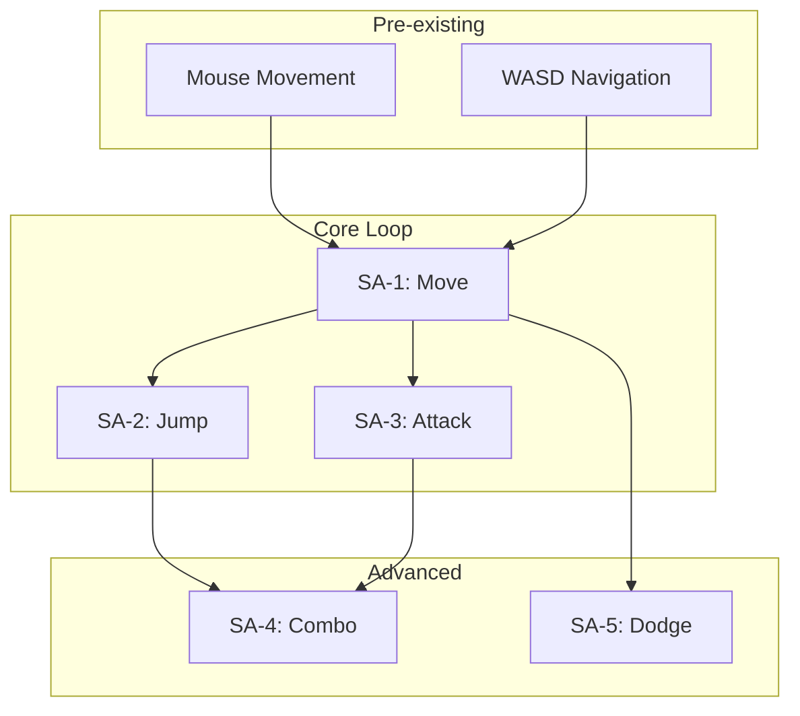
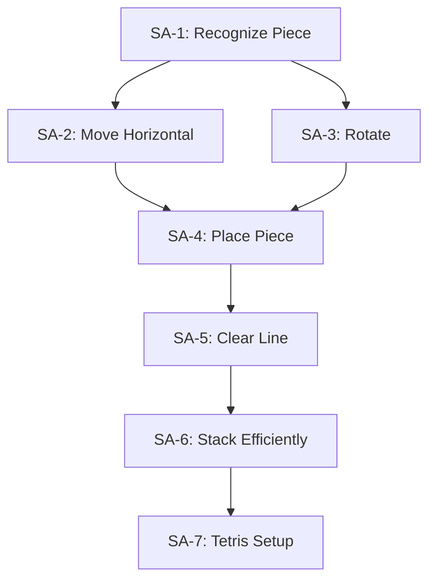

# Skill Atom Mapper

Diagram game mechanics as skill atoms and skill chains based on Daniel Cook's "Chemistry of Game Design" framework. Identify how players learn, where they might burn out, and how skills build on each other.

## When to Use This Skill

Use this skill when asked to:
- Break down a game mechanic into its learning components
- Map how skills connect and depend on each other
- Identify potential burnout points in a game's learning curve
- Analyze tutorial flow and skill progression
- Visualize the complete skill chain for a game or feature

---

## The Skill Atom Model

A **Skill Atom** is the smallest unit of player learning. It forms a complete feedback loop:

```
┌─────────────────────────────────────────────────────────┐
│                     SKILL ATOM                          │
├─────────────────────────────────────────────────────────┤
│                                                         │
│   ┌──────────┐                                          │
│   │  ACTION  │  Player performs input                   │
│   └────┬─────┘  (press button, move mouse, make choice) │
│        │                                                │
│        ▼                                                │
│   ┌──────────────┐                                      │
│   │  SIMULATION  │  Game rules process the action       │
│   └────┬─────────┘  (physics, state changes, logic)     │
│        │                                                │
│        ▼                                                │
│   ┌──────────┐                                          │
│   │ FEEDBACK │  Game shows result to player             │
│   └────┬─────┘  (visual, audio, haptic, numerical)      │
│        │                                                │
│        ▼                                                │
│   ┌──────────────┐                                      │
│   │ MENTAL MODEL │  Player updates understanding        │
│   └────┬─────────┘  (success → reinforce, fail → adjust)│
│        │                                                │
│        └──────────────► loops back to ACTION            │
│                                                         │
└─────────────────────────────────────────────────────────┘
```

### Skill Atom States

| State | Description | Indicator |
|-------|-------------|-----------|
| **Unexercised** | Player hasn't encountered this skill | No attempts recorded |
| **Active** | Player is currently learning/practicing | Repeated attempts, mixed success |
| **Mastered** | Player has internalized the skill | Consistent success, "aha!" moment |
| **Early Burnout** | Player fails to learn and abandons | High failure rate, abandonment |
| **Late Burnout** | Player masters but finds no meaningful use | Skill unused after mastery |

---

## Analysis Process

### Step 1: Identify Actions

List all distinct player actions in the mechanic/game:

```
ACTIONS INVENTORY
=================
Action 1: [name] - [input description]
Action 2: [name] - [input description]
...
```

For each action, note:
- Input method (button, mouse, gesture, menu selection)
- Timing requirements (instant, held, rhythmic)
- Precision requirements (exact, approximate, forgiving)

### Step 2: Define Skill Atoms

For each learnable skill, fill out this template:

```
SKILL ATOM: [Name]
==================
ID: SA-[number]
Prerequisites: [list of skill atom IDs that must be mastered first]

ACTION
  Input: [what the player does]
  Timing: [instant / held / rhythmic / none]
  Precision: [exact / approximate / forgiving]

SIMULATION
  Rule: [what the game does in response]
  Variables: [what affects the outcome]

FEEDBACK
  Success indicators:
    - Visual: [what player sees]
    - Audio: [what player hears]
    - Haptic: [vibration/rumble if any]
    - Numerical: [stats/numbers shown]
  Failure indicators:
    - Visual: [what player sees]
    - Audio: [what player hears]
    - Consequence: [what happens on failure]

MENTAL MODEL
  Player learns: [the insight/understanding gained]
  Mastery indicator: [how we know they've learned it]
  Estimated attempts to mastery: [number]

SKILL TYPE
  [ ] Pre-existing (player already knows from life/other games)
  [ ] Rewarded (explicitly taught through feedback)
  [ ] Emergent (discovered through experimentation)

BURNOUT RISK
  Early burnout factors: [what might cause abandonment before mastery]
  Late burnout factors: [what might make mastery feel pointless]
```

### Step 3: Build Skill Chain

Connect skill atoms into a directed graph:

```
SKILL CHAIN DIAGRAM
===================

[Pre-existing Skills]
        │
        ▼
┌───────────────┐
│ SA-1: Basic   │ ──────────────────────┐
│ Movement      │                       │
└───────┬───────┘                       │
        │                               │
        ▼                               ▼
┌───────────────┐               ┌───────────────┐
│ SA-2: Jump    │               │ SA-3: Attack  │
└───────┬───────┘               └───────┬───────┘
        │                               │
        └───────────┬───────────────────┘
                    │
                    ▼
            ┌───────────────┐
            │ SA-4: Jump    │
            │ Attack        │
            └───────────────┘
```

For Mermaid diagram output:



### Step 4: Identify Risks

#### Burnout Risk Analysis

Check for these patterns:

**Early Burnout Risks (RED FLAGS)**
- [ ] Long chain with no branching (linear dependency)
- [ ] High precision required early
- [ ] Weak or missing feedback on failure
- [ ] No partial success states
- [ ] Punishing failure (loss of progress)
- [ ] Required timing that feels arbitrary
- [ ] Skill depends on unmastered prerequisite

**Late Burnout Risks (YELLOW FLAGS)**
- [ ] Skill leads nowhere (dead end in chain)
- [ ] Mastery not recognized or rewarded
- [ ] Skill becomes obsolete (replaced by better option)
- [ ] No meaningful choices after mastery
- [ ] Repetition without variation

**Chain Health Indicators**
- [ ] Multiple paths through the chain (player choice)
- [ ] Early skills remain useful throughout
- [ ] Clear progression with visible milestones
- [ ] Skills combine in interesting ways
- [ ] Emergent possibilities from skill combinations

---

## Output Format

When mapping skill atoms, provide:

### 1. Skill Atom Inventory

| ID | Name | Type | Prerequisites | Burnout Risk |
|----|------|------|---------------|--------------|
| SA-1 | [name] | Pre-existing/Rewarded/Emergent | None/[IDs] | Low/Medium/High |
| SA-2 | [name] | ... | SA-1 | ... |

### 2. Skill Chain Diagram



### 3. Critical Path Analysis

```
CRITICAL PATH (longest chain to completion)
===========================================
PRE → SA-1 → SA-2 → SA-4 → SA-7 → SA-12

Length: 6 atoms
Estimated mastery time: [X minutes/hours]
Bottleneck: SA-4 (highest burnout risk)
```

### 4. Risk Assessment

```
HIGH RISK ATOMS
===============
SA-4: Jump Attack
  - Early burnout: Requires precise timing with weak feedback
  - Recommendation: Add timing indicator, reduce precision window

SA-7: Advanced Combo
  - Late burnout: Rarely useful after tutorial
  - Recommendation: Create scenarios requiring this skill

CHAIN HEALTH: [Good / Moderate / Poor]
```

### 5. Recommendations

Prioritized list of improvements:

1. **Critical**: [fixes for high burnout risk]
2. **Important**: [improvements for chain health]
3. **Polish**: [nice-to-have enhancements]

---

## Example: Tetris Skill Chain

```
SKILL ATOMS
===========

SA-1: Recognize Piece
  Action: Observe falling piece
  Simulation: Piece appears at top
  Feedback: Visual piece display
  Mental Model: "I know what shape this is"
  Type: Rewarded
  Prerequisites: None

SA-2: Move Piece Horizontally
  Action: Left/Right input
  Simulation: Piece shifts columns
  Feedback: Piece visually moves
  Mental Model: "I control horizontal position"
  Type: Pre-existing (arrow keys)
  Prerequisites: SA-1

SA-3: Rotate Piece
  Action: Rotate input
  Simulation: Piece rotates 90 degrees
  Feedback: Visual rotation
  Mental Model: "I can change piece orientation"
  Type: Rewarded
  Prerequisites: SA-1

SA-4: Place Piece
  Action: Let piece fall / hard drop
  Simulation: Piece locks into grid
  Feedback: Piece becomes static, new piece spawns
  Mental Model: "Pieces become permanent when they land"
  Type: Rewarded
  Prerequisites: SA-2, SA-3

SA-5: Clear Line
  Action: Complete a horizontal row
  Simulation: Row disappears, pieces above fall
  Feedback: Line flash, score increase, satisfying sound
  Mental Model: "Complete rows = points and space"
  Type: Rewarded
  Prerequisites: SA-4

SA-6: Stack Efficiently
  Action: Place pieces to minimize gaps
  Simulation: Fewer holes in stack
  Feedback: Taller stable stack, more line clears
  Mental Model: "Flat stacks are better than holey ones"
  Type: Emergent
  Prerequisites: SA-5

SA-7: Set Up Tetris (4-line clear)
  Action: Leave column open, wait for I-piece
  Simulation: 4 lines clear at once
  Feedback: Big score bonus, screen effect
  Mental Model: "Saving for I-piece is high risk/high reward"
  Type: Emergent
  Prerequisites: SA-6
```



---

## Reference

Based on Daniel Cook's frameworks:
- [The Chemistry of Game Design](https://lostgarden.com/2007/07/19/the-chemistry-of-game-design/)
- [Smashing the Game Design Atom](https://lostgarden.com/2007/11/17/project-horseshoe-2007-slides-smashing-the-game-design-atom/)
- [Building Tight Game Systems of Cause and Effect](https://lostgarden.com/2012/07/01/building-tight-game-systems-of-cause-and-effect/)
