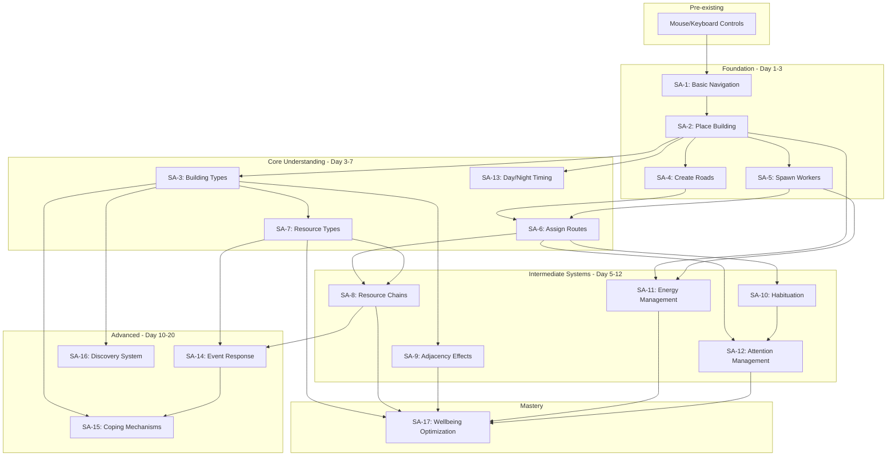

# Skill Atom Mapper Analysis: PsycheBuilder

## Step 1: Actions Inventory

```
ACTIONS INVENTORY
=================
Action 1: Place Building - Click toolbar button, click grid location
Action 2: Remove Building - Select building, click "Remove" button
Action 3: Pan Camera - Click+drag or arrow keys
Action 4: Zoom Camera - Mouse wheel
Action 5: Spawn Worker - Click "Add Worker" button (costs 2 energy)
Action 6: Assign Transport - Select building → click "Assign Worker" → click destination
Action 7: Select Worker - Click on worker mote
Action 8: Remove Worker - Select worker, press Delete
Action 9: Change Speed - Click 1x/2x/3x buttons
Action 10: Cancel Action - Right-click or Escape
Action 11: Event Choice - Click choice button in event popup
```

---

## Step 2: Skill Atom Definitions

### SA-1: Basic Navigation
```
SKILL ATOM: Basic Navigation
============================
ID: SA-1
Prerequisites: None

ACTION
  Input: Click+drag, arrow keys, mouse wheel
  Timing: None
  Precision: Forgiving

SIMULATION
  Rule: Camera pans/zooms to show different parts of mind-city
  Variables: Grid size (50x50), zoom limits

FEEDBACK
  Success indicators:
    - Visual: Screen shows desired area
    - Audio: None
    - Numerical: None
  Failure indicators:
    - Visual: Camera stops at edge
    - Consequence: None

MENTAL MODEL
  Player learns: The mind-city is a spatial grid to navigate
  Mastery indicator: Player can quickly find and view desired buildings
  Estimated attempts to mastery: 2-3

SKILL TYPE
  [X] Pre-existing (mouse/keyboard navigation from other games)
  [ ] Rewarded
  [ ] Emergent

BURNOUT RISK
  Early burnout factors: None (trivial skill)
  Late burnout factors: None
```

### SA-2: Place Building
```
SKILL ATOM: Place Building
==========================
ID: SA-2
Prerequisites: SA-1

ACTION
  Input: Click toolbar button, click grid location
  Timing: None
  Precision: Approximate (grid snaps)

SIMULATION
  Rule: Building placed if energy sufficient and cells unoccupied
  Variables: Building cost (1-8 energy), building size (1x1 to 3x3)

FEEDBACK
  Success indicators:
    - Visual: Building appears on grid with color coding
    - Audio: Placement sound (if implemented)
    - Numerical: Energy decreases in HUD
  Failure indicators:
    - Visual: Placement preview shows red/invalid
    - Consequence: Building not placed, energy retained

MENTAL MODEL
  Player learns: Buildings cost energy and occupy grid space
  Mastery indicator: Player places buildings without hovering invalid cells
  Estimated attempts to mastery: 5-8

SKILL TYPE
  [X] Pre-existing (city-builder placement conventions)
  [ ] Rewarded
  [ ] Emergent

BURNOUT RISK
  Early burnout factors: 
    - Unclear why placement fails (CURRENT RISK)
    - No visual feedback on WHY placement invalid
  Late burnout factors: None
```

### SA-3: Understand Building Types
```
SKILL ATOM: Understand Building Types
=====================================
ID: SA-3
Prerequisites: SA-2

ACTION
  Input: Hover/select buildings, read tooltips/panel
  Timing: None
  Precision: Forgiving

SIMULATION
  Rule: Buildings have behaviors (Generator, Processor, Storage, Habit, Coping, Global Effect)
  Variables: 60+ building definitions with distinct functions

FEEDBACK
  Success indicators:
    - Visual: Building info panel shows description, behaviors
    - Numerical: Input/output ratios, storage capacity
  Failure indicators:
    - Visual: Suboptimal placement, idle buildings
    - Consequence: Inefficient resource flow

MENTAL MODEL
  Player learns: Building categories and their roles in the processing chain
  Mastery indicator: Player can describe what each building type does without hovering
  Estimated attempts to mastery: 15-25

SKILL TYPE
  [ ] Pre-existing
  [X] Rewarded (descriptions teach function)
  [ ] Emergent

BURNOUT RISK
  Early burnout factors:
    - TOO MANY BUILDING TYPES (~60) overwhelming for new players (HIGH RISK)
    - Descriptions are technical, not experiential
    - No guided introduction to building categories
  Late burnout factors:
    - Buildings may feel samey within categories
```

### SA-4: Create Road Networks
```
SKILL ATOM: Create Road Networks
================================
ID: SA-4
Prerequisites: SA-2

ACTION
  Input: Select Road from toolbar, click-drag to place road tiles
  Timing: None
  Precision: Approximate (grid-based)

SIMULATION
  Rule: Workers pathfind along roads between connected buildings
  Variables: Road cost (1 energy), Highway speed bonus (1.5x)

FEEDBACK
  Success indicators:
    - Visual: Road appears, workers can travel
    - Audio: None specified
  Failure indicators:
    - Visual: Workers stuck, "no path" indicator
    - Consequence: Resources cannot move

MENTAL MODEL
  Player learns: Buildings must be connected by roads for resources to flow
  Mastery indicator: Player builds efficient road layouts with minimal tiles
  Estimated attempts to mastery: 8-12

SKILL TYPE
  [ ] Pre-existing
  [X] Rewarded (workers visibly use roads)
  [ ] Emergent

BURNOUT RISK
  Early burnout factors:
    - May not realize roads are required initially (MEDIUM RISK)
    - Tutorial hint on Day 1 helps but is passive
  Late burnout factors: None (road building remains useful)
```

### SA-5: Spawn Workers
```
SKILL ATOM: Spawn Workers
=========================
ID: SA-5
Prerequisites: SA-2, SA-4

ACTION
  Input: Click "Add Worker" button
  Timing: None
  Precision: Exact (button click)

SIMULATION
  Rule: Worker appears, costs 2 energy
  Variables: Energy cost, attention pool limit

FEEDBACK
  Success indicators:
    - Visual: Glowing mote appears
    - Numerical: Energy decreases by 2
  Failure indicators:
    - Visual: Button disabled if insufficient energy
    - Consequence: Cannot add worker

MENTAL MODEL
  Player learns: Workers cost energy to create but persist
  Mastery indicator: Player spawns workers strategically when needed
  Estimated attempts to mastery: 3-5

SKILL TYPE
  [ ] Pre-existing
  [X] Rewarded
  [ ] Emergent

BURNOUT RISK
  Early burnout factors: None (simple action)
  Late burnout factors: None
```

### SA-6: Assign Worker Routes
```
SKILL ATOM: Assign Worker Routes
================================
ID: SA-6
Prerequisites: SA-5

ACTION
  Input: Select building → "Assign Worker" → click destination
  Timing: None
  Precision: Approximate

SIMULATION
  Rule: Worker assigned to transport resources between buildings
  Variables: Path length, habituation level, attention cost

FEEDBACK
  Success indicators:
    - Visual: Worker starts moving along route
    - Numerical: Attention pool decreases initially
  Failure indicators:
    - Visual: "No path" error if buildings not connected
    - Consequence: Worker cannot complete assignment

MENTAL MODEL
  Player learns: Workers need explicit routes; routes cost attention initially
  Mastery indicator: Player assigns efficient routes that become habituated
  Estimated attempts to mastery: 10-15

SKILL TYPE
  [ ] Pre-existing
  [X] Rewarded
  [ ] Emergent

BURNOUT RISK
  Early burnout factors:
    - Three-step process may feel cumbersome (MEDIUM RISK)
    - No clear indication of WHAT to transport WHERE
  Late burnout factors:
    - Route management becomes tedious at scale
```

### SA-7: Understand Resource Types
```
SKILL ATOM: Understand Resource Types
=====================================
ID: SA-7
Prerequisites: SA-3

ACTION
  Input: Observe resources, read descriptions, see effects
  Timing: None
  Precision: Forgiving

SIMULATION
  Rule: 30+ resource types with categories (positive/negative/derived/neutral)
  Variables: Decay rates, tags, spawn amounts

FEEDBACK
  Success indicators:
    - Visual: Resources glow with category colors
    - Numerical: Resource totals in HUD
  Failure indicators:
    - Visual: Negative resources accumulate, Wellbeing drops
    - Consequence: Harder run

MENTAL MODEL
  Player learns: Positive emotions boost Wellbeing, negative must be processed
  Mastery indicator: Player can name resources and their effects without tooltips
  Estimated attempts to mastery: 20-30 (HIGH)

SKILL TYPE
  [ ] Pre-existing
  [X] Rewarded
  [ ] Emergent

BURNOUT RISK
  Early burnout factors:
    - TOO MANY RESOURCES (30+) to learn (HIGH RISK)
    - Unclear which resources are urgent vs ignorable
    - Resource categories not visually distinct enough
  Late burnout factors:
    - Some resources rarely encountered
```

### SA-8: Resource Chain Building
```
SKILL ATOM: Resource Chain Building
===================================
ID: SA-8
Prerequisites: SA-3, SA-6, SA-7

ACTION
  Input: Place generator → place processor → assign worker route
  Timing: None
  Precision: Approximate

SIMULATION
  Rule: Generators produce resources, processors transform them
  Variables: Generation rates, process times, input/output ratios

FEEDBACK
  Success indicators:
    - Visual: Resources flow through chain, outputs accumulate
    - Numerical: Processing throughput increases
  Failure indicators:
    - Visual: Bottlenecks, overflow, idle buildings
    - Consequence: Inefficient Wellbeing growth

MENTAL MODEL
  Player learns: Create production chains: Source → Storage → Processor → Output
  Mastery indicator: Player builds efficient chains without idle buildings
  Estimated attempts to mastery: 25-40 (HIGH)

SKILL TYPE
  [ ] Pre-existing
  [ ] Rewarded
  [X] Emergent (discovered through experimentation)

BURNOUT RISK
  Early burnout factors:
    - Complex prerequisite chain (SA-3 + SA-6 + SA-7) must all be mastered first (HIGH RISK)
    - No tutorial shows example chain setup
    - Unclear what outputs go where
  Late burnout factors:
    - Optimal chains may be solved/static
```

### SA-9: Understand Adjacency Effects
```
SKILL ATOM: Understand Adjacency Effects
========================================
ID: SA-9
Prerequisites: SA-2, SA-3

ACTION
  Input: Place buildings near each other, observe green/red lines
  Timing: None
  Precision: Approximate (2-tile radius)

SIMULATION
  Rule: Adjacent buildings apply synergy (+efficiency) or conflict (-efficiency) effects
  Variables: 20+ adjacency rules, radius of 2 tiles

FEEDBACK
  Success indicators:
    - Visual: Green lines show synergies when building selected
    - Numerical: Efficiency multipliers in building panel
  Failure indicators:
    - Visual: Red lines show conflicts
    - Consequence: Reduced building efficiency

MENTAL MODEL
  Player learns: Building placement matters spatially; synergies reward clusters
  Mastery indicator: Player places synergistic pairs deliberately
  Estimated attempts to mastery: 15-25

SKILL TYPE
  [ ] Pre-existing
  [ ] Rewarded
  [X] Emergent (discovered by experimentation or reading how-to-play)

BURNOUT RISK
  Early burnout factors:
    - Synergies not visible until AFTER placement (MEDIUM RISK)
    - No preview of adjacency effects during placement
    - Rules not discoverable in-game without external docs
  Late burnout factors:
    - Optimal layouts may become rote
```

### SA-10: Habituation Management
```
SKILL ATOM: Habituation Management
==================================
ID: SA-10
Prerequisites: SA-6

ACTION
  Input: Keep workers on same routes over time
  Timing: Extended (50 completions for automatic)
  Precision: Forgiving

SIMULATION
  Rule: Repeated worker routes reduce attention cost: 1.0 → 0.5 → 0.25 → 0.1 → 0
  Variables: Thresholds at 3, 10, 25, 45 completions

FEEDBACK
  Success indicators:
    - Numerical: Attention cost decreases over time
    - Visual: Worker indicator shows habituation level (if implemented)
  Failure indicators:
    - Consequence: Attention pool constrained if workers reassigned

MENTAL MODEL
  Player learns: Stable routes become free; changing routes costs attention
  Mastery indicator: Player plans long-term routes, avoids reassignment
  Estimated attempts to mastery: 30-50 (requires persistence)

SKILL TYPE
  [ ] Pre-existing
  [X] Rewarded (attention savings visible)
  [ ] Emergent

BURNOUT RISK
  Early burnout factors:
    - VERY LONG TIME to see payoff (50 completions) (MEDIUM RISK)
    - Progress not clearly visualized
  Late burnout factors:
    - May feel like punishment for adapting to events
```

### SA-11: Energy Management
```
SKILL ATOM: Energy Management
=============================
ID: SA-11
Prerequisites: SA-2, SA-5

ACTION
  Input: Decide when to spend energy (buildings, workers)
  Timing: Day-by-day budgeting
  Precision: Approximate

SIMULATION
  Rule: Energy regenerates +4/day, caps at 20, spent on buildings (1-8) and workers (2)
  Variables: Starting 8, max 20, regen 4/day

FEEDBACK
  Success indicators:
    - Numerical: Energy meter stays healthy
    - Visual: Can afford desired actions
  Failure indicators:
    - Numerical: Energy depleted
    - Consequence: Cannot build or spawn workers

MENTAL MODEL
  Player learns: Energy is a daily budget; balance building vs saving
  Mastery indicator: Player ends days with optimal energy usage
  Estimated attempts to mastery: 10-15

SKILL TYPE
  [ ] Pre-existing (resource budgeting common in games)
  [X] Rewarded
  [ ] Emergent

BURNOUT RISK
  Early burnout factors:
    - Low starting energy (8) may feel constraining (LOW RISK)
  Late burnout factors: None
```

### SA-12: Attention Management
```
SKILL ATOM: Attention Management
================================
ID: SA-12
Prerequisites: SA-6, SA-10

ACTION
  Input: Assign workers within attention budget, leverage habituation
  Timing: Ongoing
  Precision: Approximate

SIMULATION
  Rule: Base attention pool of 10, worker assignments cost 0-1 attention based on habituation
  Variables: Pool size, habituation multipliers

FEEDBACK
  Success indicators:
    - Numerical: Attention pool not depleted
    - Visual: Workers remain active
  Failure indicators:
    - Consequence: Cannot assign new workers

MENTAL MODEL
  Player learns: Attention limits active workers; habituation frees attention
  Mastery indicator: Player maximizes workers via habituation strategy
  Estimated attempts to mastery: 20-30

SKILL TYPE
  [ ] Pre-existing
  [ ] Rewarded
  [X] Emergent (system interactions discovered)

BURNOUT RISK
  Early burnout factors:
    - System is INVISIBLE until you hit the cap (HIGH RISK)
    - No clear indicator of attention usage in UI
  Late burnout factors:
    - Once habituated, system becomes irrelevant
```

### SA-13: Day/Night Timing
```
SKILL ATOM: Day/Night Timing
============================
ID: SA-13
Prerequisites: SA-2

ACTION
  Input: Build/plan during night (paused), observe during day
  Timing: 50s day / 8s night cycle
  Precision: Forgiving

SIMULATION
  Rule: Daytime: simulation runs, resources flow. Night: planning phase, habits trigger
  Variables: Day 50s, night 8s, speed modifiers (1x/2x/3x)

FEEDBACK
  Success indicators:
    - Visual: Day/night indicator in HUD
    - Visual: Brightness/color changes
  Failure indicators:
    - Consequence: Suboptimal planning if rushed

MENTAL MODEL
  Player learns: Plan during night, observe/adjust during day
  Mastery indicator: Player uses night phase productively for planning
  Estimated attempts to mastery: 5-10

SKILL TYPE
  [X] Pre-existing (day/night cycles common in games)
  [ ] Rewarded
  [ ] Emergent

BURNOUT RISK
  Early burnout factors:
    - Night phase may feel too short (8s) for planning (LOW RISK)
  Late burnout factors: None
```

### SA-14: Event Response
```
SKILL ATOM: Event Response
==========================
ID: SA-14
Prerequisites: SA-7, SA-8

ACTION
  Input: Read event popup, select choice
  Timing: Events pause game for decision
  Precision: Exact (button click)

SIMULATION
  Rule: Events spawn resources, offer choices with tradeoffs
  Variables: 6 inciting incidents, multiple minor events

FEEDBACK
  Success indicators:
    - Visual: Event popup shows description, choices
    - Numerical: Spawned resources visible in city
  Failure indicators:
    - Visual: Event resources overwhelm processing capacity
    - Consequence: Wellbeing drops

MENTAL MODEL
  Player learns: Events test your processing capacity; choices have consequences
  Mastery indicator: Player prepares for events, makes informed choices
  Estimated attempts to mastery: 5-10 (limited events per run)

SKILL TYPE
  [ ] Pre-existing
  [X] Rewarded (events explicitly teach)
  [ ] Emergent

BURNOUT RISK
  Early burnout factors:
    - Inciting incident on Day 5 may overwhelm unprepared players (MEDIUM RISK)
    - Choice consequences not clear in advance
  Late burnout factors:
    - Limited event variety (6 inciting incidents)
```

### SA-15: Coping Mechanism Usage
```
SKILL ATOM: Coping Mechanism Usage
==================================
ID: SA-15
Prerequisites: SA-3, SA-14

ACTION
  Input: Build coping buildings (Emergency Calm Center, Anger Vent, etc.)
  Timing: Reactive (triggers on thresholds)
  Precision: Approximate

SIMULATION
  Rule: Coping buildings activate when resource thresholds exceeded
  Variables: Trigger conditions (anxiety > 10, anger > 8, etc.), cooldowns

FEEDBACK
  Success indicators:
    - Visual: Coping building activates, processes surge
    - Numerical: Resource spike handled
  Failure indicators:
    - Consequence: Overwhelm without coping mechanisms

MENTAL MODEL
  Player learns: Coping buildings are safety valves for emotional spikes
  Mastery indicator: Player places coping buildings strategically before events
  Estimated attempts to mastery: 8-15

SKILL TYPE
  [ ] Pre-existing
  [ ] Rewarded
  [X] Emergent (triggered automatically when conditions met)

BURNOUT RISK
  Early burnout factors:
    - Coping buildings are NOT unlocked by default (HIGH RISK)
    - Player may not discover them before first event
  Late burnout factors: None
```

### SA-16: Discovery System
```
SKILL ATOM: Discovery System
============================
ID: SA-16
Prerequisites: SA-3

ACTION
  Input: Choose 1 of 3 offered buildings at end of some nights
  Timing: End of day (40% chance starting Day 2)
  Precision: Exact (click choice)

SIMULATION
  Rule: Unlock new building from random pool based on insight level
  Variables: discovery_chance 0.4, options_count 3

FEEDBACK
  Success indicators:
    - Visual: Discovery popup with 3 building options
    - Consequence: New building added to palette
  Failure indicators:
    - Consequence: Suboptimal choice limits strategy options

MENTAL MODEL
  Player learns: Runs differ based on discovery choices; plan around unlocks
  Mastery indicator: Player evaluates discoveries based on current needs
  Estimated attempts to mastery: 10-15 (multiple runs)

SKILL TYPE
  [ ] Pre-existing
  [X] Rewarded
  [ ] Emergent

BURNOUT RISK
  Early burnout factors: None
  Late burnout factors:
    - Random offerings may feel unfair (MEDIUM RISK)
```

### SA-17: Wellbeing Optimization
```
SKILL ATOM: Wellbeing Optimization
==================================
ID: SA-17
Prerequisites: SA-7, SA-8, SA-9, SA-11, SA-12

ACTION
  Input: Balance all systems to maximize Wellbeing score
  Timing: Ongoing across 20 days
  Precision: Approximate

SIMULATION
  Rule: Wellbeing = (positive*2 + derived*3 - negative*1.5 - unprocessed*2 + habits + synergies) / 50
  Variables: All resource counts, building states, adjacency effects

FEEDBACK
  Success indicators:
    - Visual: Wellbeing meter rises, city brightens
    - Numerical: Score increases toward 80+
  Failure indicators:
    - Visual: Wellbeing drops, city dims
    - Consequence: Lower ending tier

MENTAL MODEL
  Player learns: Wellbeing emerges from systemic health, not single actions
  Mastery indicator: Player consistently achieves Flourishing ending
  Estimated attempts to mastery: 5-10 runs

SKILL TYPE
  [ ] Pre-existing
  [ ] Rewarded
  [X] Emergent (emerges from system mastery)

BURNOUT RISK
  Early burnout factors:
    - MANY prerequisite skills required (HIGH RISK)
    - Wellbeing formula is opaque
  Late burnout factors:
    - Optimal strategies may become rote
```

---

## Step 3: Skill Chain Diagram



---

## Step 4: Critical Path Analysis

```
CRITICAL PATH (longest chain to Wellbeing mastery)
==================================================
PRE1 → SA-1 → SA-2 → SA-4 → SA-6 → SA-10 → SA-12 → SA-17
       ↓           ↓
      SA-3 → SA-7 → SA-8 → SA-17 (parallel requirement)
             ↓
            SA-9 → SA-17 (parallel requirement)

Length: 8 atoms on main path + 3 parallel requirements = 11 skills total
Estimated mastery time: 3-5 complete runs (60-100 in-game days)

BOTTLENECKS:
1. SA-3 (Building Types) - Too many to learn at once
2. SA-7 (Resource Types) - 30+ resources overwhelming
3. SA-8 (Resource Chains) - Complex prerequisite chain
4. SA-12 (Attention Management) - System invisible until cap hit
```

---

## Step 5: Risk Assessment

```
HIGH RISK ATOMS
===============

SA-3: Building Types
  - Early burnout: 60+ buildings with technical descriptions
  - Recommendation: 
    * Limit starting palette to 8-10 VISIBLY DISTINCT categories
    * Show building PURPOSE not just mechanics
    * Group by "What problem does this solve?"

SA-7: Resource Types
  - Early burnout: 30+ resources without clear priority
  - Recommendation:
    * Visual urgency indicators (pulsing negative resources)
    * Categorize as "Process Now" vs "Process Later"
    * Color-code by urgency, not just positive/negative

SA-8: Resource Chains
  - Early burnout: Requires 3 skills mastered first with no guidance
  - Recommendation:
    * Add "Suggested Connection" highlight when placing buildings
    * Starting map should have ONE working chain as example
    * Tutorial Day 3 should walk through creating a chain

SA-12: Attention Management
  - Early burnout: System invisible until you hit constraint
  - Recommendation:
    * Always show "Attention: 7/10 used" in HUD
    * Show attention cost BEFORE assigning worker
    * Visual indicator on workers showing their current attention cost

SA-15: Coping Mechanisms
  - Early burnout: Not unlocked by default, needed before Day 5 event
  - Recommendation:
    * Include ONE coping building (Emergency Calm Center) in starting palette
    * Or delay inciting incident until player has discovered a coping building

SA-17: Wellbeing Optimization
  - Early burnout: Too many prerequisites, opaque formula
  - Recommendation:
    * Show Wellbeing breakdown on hover ("Positive: +40, Negative: -25, etc.")
    * Add mini-goals: "Process 3 Grief for +5 Wellbeing"


MEDIUM RISK ATOMS
=================

SA-2: Place Building
  - Issue: No feedback on WHY placement fails
  - Fix: Show reason on hover ("Overlaps existing building", "Insufficient energy")

SA-6: Assign Worker Routes
  - Issue: Three-step process with no guidance on WHAT to transport
  - Fix: Highlight "This building has resources ready to transport" 

SA-9: Adjacency Effects
  - Issue: Effects not visible until after placement
  - Fix: Show adjacency preview while placement ghost is hovering

SA-10: Habituation
  - Issue: 50 completions is very long, progress not visible
  - Fix: Show habituation progress bar on workers, milestone notifications

SA-14: Event Response
  - Issue: Day 5 event may overwhelm unprepared players
  - Fix: Give warning on Day 4 night: "Prepare for tomorrow's challenge"


CHAIN HEALTH: MODERATE
======================
[X] Multiple paths through chain (building vs resource vs worker focus)
[ ] Early skills remain useful throughout - PARTIAL (roads become trivial)
[X] Clear progression with visible milestones - IF Wellbeing breakdown shown
[ ] Skills combine in interesting ways - LIMITED (adjacency is only combination)
[ ] Emergent possibilities from skill combinations - LIMITED
```

---

## Recommendations

### Critical (High Priority)

1. **Reduce initial cognitive load**
   - Limit starting building palette to 10 buildings max
   - Group buildings by problem solved: "Generate Calm", "Process Grief", "Store Emotions"
   - Add visual icons to building categories

2. **Make Attention visible**
   - Add "Attention: X/10" to HUD permanently
   - Show attention cost preview when assigning workers
   - Add attention cost indicator on worker motes

3. **Provide example chain on start**
   - Starting map should demonstrate: Memory Well → (road) → Emotional Reservoir → (road) → Mourning Chapel
   - Include one pre-assigned worker showing the flow

4. **Include coping building in starting palette**
   - Either Emergency Calm Center or Distraction Station
   - Or warn player on Day 4: "Tomorrow brings challenge. Consider building safety valves."

5. **Make Wellbeing formula transparent**
   - Hover Wellbeing to see breakdown: "Positive emotions: +40, Derived: +15, Negative: -30, Habits: +5"
   - Show "+2 Wellbeing" floaters when processing completes

### Important (Medium Priority)

6. **Improve placement feedback**
   - Show WHY placement is invalid on hover
   - Show adjacency synergies/conflicts during placement preview

7. **Add resource urgency indicators**
   - Pulsing/growing negative resources when above thresholds
   - "Worry is compounding!" notification when > 3

8. **Habituation progress visualization**
   - Progress ring around worker mote
   - Notification when worker reaches new habituation level

9. **Event preparation hints**
   - Day 4 night: "Day 5 brings a major life event. Ensure you have processing capacity."
   - Show event category hints so player can prepare

10. **Guided resource chain tutorial**
    - Day 3 hint should walk through: "Select Memory Well → Click 'Assign Worker' → Click Mourning Chapel"

### Polish (Low Priority)

11. **Adjacency preview during placement**
    - Ghost building shows green/red lines to nearby buildings

12. **Building "what I need" indicators**
    - Processors show "Needs: Grief" when input storage empty
    - Generators show "Full!" when storage capped

13. **Quick-assign shortcuts**
    - Shift-click on two connected buildings to auto-assign worker route

14. **Milestone celebrations**
    - "First chain completed!" popup with confetti
    - "Worker fully habituated!" notification

15. **Resource flow visualization**
    - Optional overlay showing resource movement paths

---

## Summary

PsycheBuilder has a rich skill chain with meaningful depth, but suffers from **front-loaded complexity**. Players must learn 30+ resources, 60+ buildings, and multiple interacting systems before they can engage with the core Wellbeing optimization loop.

**Primary Risk**: Early burnout from information overload before experiencing the satisfying emergent gameplay.

**Key Fix**: Make invisible systems visible (attention, habituation progress, Wellbeing breakdown) and provide one working example chain on start.

The game's metaphor (mind as city) is strong, but players need to experience success quickly before diving into complexity. Consider a "sandbox" first 3 days where nothing goes wrong, allowing skill atoms SA-1 through SA-6 to be mastered before introducing the challenge of events and resource pressure.